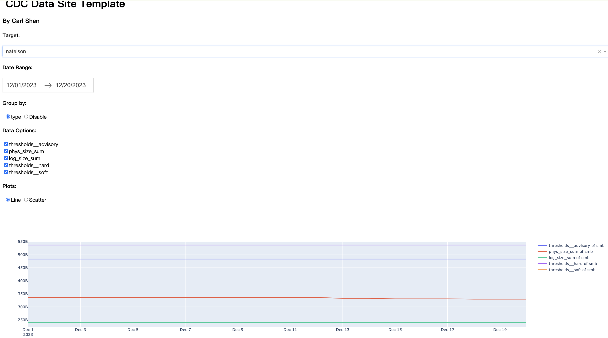

# RDF Usage Stats

## Overview

This template is used for building a visualization website powered by ploty dash for time-series data of CRC. The template only support line and scatter plot currently.
This template will automatically generating line and scatter plots of the given data with group by and filter supported regardless of the schema of the data as long as the data meets the following requirements. 

## Dataset Requirements
The template can embed the data and build a website on it as long as the dataset:
* is structural.
* is in .csv form.
* is well-preprocessed. This template does not support data cleaning module.
* is a time-series data with at least one column to indicate the time.
* has the time column in "yyyy-mm-dd" format.

Note: the data schema is similar to a time-series data with one column indicating the time and multiple other numerical columns indicating the values. So basically we expect the data can be well represented by a line plot or scatter plot with the horizontal coordinate of time.

## System Requirements

Note: While this document is primarily tailored for MacOS users, the instructions should be adaptable for Linux systems. Contributions from Windows users are also welcome.

```shell
# Make sure the Xcode CLI Tools are installed

sudo xcodebuild -license
xcode-select --install
```

## Setting Up a Local Environment

```shell
# Fork the repository to your GitHub account:
# - Go to https://github.com/rice-crc/rdf-usage-stats
# - Click "Fork" in the top right corner
# - Select your GitHub account

# Clone the fork to your local environment.

git clone https://github.com/<user>/crc-datasite-template
cd crc-datasite-template

# Add the parent repository as the "upstream" remote.

git add remote upstream https://github.com/rice-crc/crc-datasite-template
```

## Running the Project

### In CLI

```shell
cd crc-datasite-template

# Create a python virtual environment

python -m venv venv
source venv/bin/activate

# Install app dependencies

pip install -r src/requirements.txt

# Run the app with default host ("127.0.0.1"), port (8050), and data directory ("/srv/build/rdf-usage-data/2023/")

python application.py

# Or run the app with specified values

python application.py --host <your host> --port <your port> --datadir <your data directory>

# Clean up when done

deactivate
```

### Via container

```shell
cd crc-datasite-template

# Configure the local configuration file
# - Copy the .env file to the src/ from where it is
# - Populate with appropriate settings

cp path-to-env-file/.env src/.env

# Build the Docker image and run the container

docker compose up --build

# Stop the container when done

docker compose down
```

## Resources

* App Web UI: http://127.0.0.1:8050/

## Contributing Guide
### File Structure
Under src folder, there are several files can be modified according to custom needs:
* application.py -- this file contains a rice csa application, which will be the server of the dash app. For more information, please go to: https://github.com/rice-crc/rice-cas-example
* auth.py -- this is for user authority verification.
* config.py -- this is for reading and parsing the configuration
* dash_app.py -- this file contains the logic for dash website visualization and the interaction with the data

Specifically, dash_app.py is the only thing that needs to be changed if the visualization and data interaction logic of this template needs to be modified.

### .env configuration file
In most cases, the only thing that needs to be modified is the .env file if the logic behind the template works fine
There are five fields in the file related to a given data and have a big impact on the representation of the data:
* DATE_COL -- for specifying the time column of the data
* RATIO_COLS -- for specifying the columns which contain several groups of the data and can be used in "group by" manner in visualization
* DROP_DOWN_COL -- for specifying the column which contain several categories for the data and can be used as data filters
* SITE_NAME -- the name of the website
* AUTHOR -- the author

Note: the RATIO_COLS and DROP_DOWN_COL can be left with no value specified if we do not need them. It will not influence the data visualization.

## Contributing Workflow
This project follows a fork-and-pull workflow:

- The `upstream` remote refers to the parent and `origin` refers to your fork
- Merge changes through Pull Requests from `origin/working-branch` to `upstream/main`

Keep the following in mind when contributing code:

- Keep your local and fork repositories in sync with upstream changes
- Always start new work with a new working branch
- Don't commit directly to the main branch
- Consider syncing your working branch with upstream before opening a Pull Request if the repository is very active or if there is a chance of overlapping changes
- Ensure that your code is tested and complete. If you need feedback on unfinished work, feel free to create a Pull Request for review, but make sure to clearly mark it as a work-in-progress or for discussion purposes only
- Clean up your local repository once your Pull Request has been merged

Contribute by following the step-by-step git process outlined below.

```shell
###
### Daily Work
###

# Pull the latest changes from upstream to ensure your main branch is up-to-date.

git checkout main
git pull upstream main

# Create a new branch based off of main to isolate your work.

git checkout -b working-branch

# Commit your changes using a concise and descriptive title.

git add .
git commit -m "Add small change"

# (Optional) Clean up before pushing your branch for a Pull Request:
#
# Use this step if upstream activity is high or you're collaborating 
# closely with others on overlapping features. Rebasing is a preference
# to minimize merge commits. Only rebase on your local working branch.
#
# - Pull the latest changes from upstream
# - Rebase the changes in your working branch
# - Commit fixes to resolve any merge conflicts

git pull --rebase upstream main

git add .
git commit -m "Fixes merge conflict"

###
### Pull Request
###

# Push your working branch to your fork on GitHub.

git push -u origin HEAD

# Open a Pull Request (PR) to merge your changes upstream:
# - Go to https://github.com/<user>/rdf-usage-stats
# - Go to Pull Requests
# - Click "New pull request"
# - Set the base repository and branch as the parent and main
# - Set the head repository and branch as your fork and working branch
# - Give a concise title and description to the PR

# If there is feedback during the PR review:
# - Commit changes to resolve the feedback
# - Update the PR by pushing the branch to your fork

git add .
git commit -m "Resolves PR feedback"
git push origin HEAD

###
### Clean Up
###

# After the PR is merged and your work is complete, delete your working branch.

git checkout main
git branch -D working-branch

# Pull the latest changes from upstream and update your fork on GitHub to make sure everything is in sync.

git pull upstream main
git push origin main


###
### Remedy if features developed with main branch are pushed
### 

# Assume you are at main branch
# save the changes to the work-branch
git branch work-branch

# reset the local main branch
git reset --hard upstream/main

# reset the origin main branch
git push origin main --force

# switch to the work branch when developing
git checkout work-branch
```

## Use Case
#### Using the covid mortality dataset
Website:


.env file:


#### Using the rdf usage dataset
Website:



.env file:


